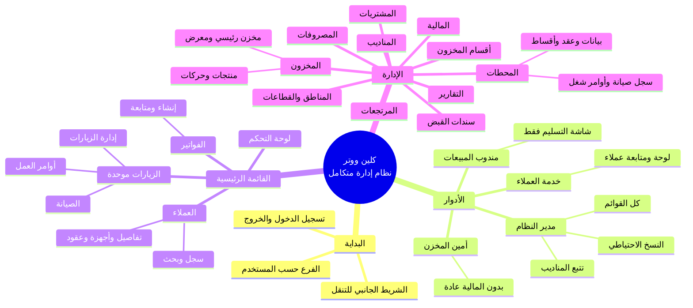

# خريطة ذهنية — نظام كلين ووتر

انسخ كتلة `mermaid` أدناه والصقها في [Mermaid Live Editor](https://mermaid.live) أو أي أداة تدعم Mermaid لعرض الخريطة وتصديرها PNG/SVG.



---

## نسخة نصية هرمية (للنسخ السريع)

```
كلين ووتر — نظام إدارة متكامل
├── البداية
│   ├── تسجيل الدخول والخروج
│   ├── الشريط الجانبي (قائمة رئيسية + إدارة)
│   └── الفرع (تصفية حسب فرع المستخدم)
├── الأدوار
│   ├── مدير النظام → كل القوائم + تتبع مناديب + نسخ احتياطي
│   ├── أمين المخزن → مخزون وزيارات ومحطات… (بدون مالية عادة)
│   ├── خدمة العملاء → لوحة + متابعة + عملاء وفواتير وزيارات وصيانة وأوامر
│   └── مندوب مبيعات → شاشة التسليم فقط
├── القائمة الرئيسية
│   ├── لوحة التحكم
│   ├── العملاء
│   ├── الفواتير
│   └── الزيارات (صفحة واحدة)
│       ├── تبويب: إدارة الزيارات
│       ├── تبويب: الصيانة
│       └── تبويب: أوامر العمل
└── الإدارة
    ├── المخزون (+ حركات ومواقع)
    ├── أقسام المخزون
    ├── المرتجعات
    ├── المشتريات
    ├── المحطات (+ عقد وأقساط وصيانة)
    ├── المناطق والقطاعات
    ├── المناديب
    ├── المالية
    ├── المصروفات
    ├── سندات القبض
    └── التقارير
```

---

## كيف تعرضها كصورة

1. افتح **https://mermaid.live**
2. الصق محتوى كتلة `mermaid` فقط (من `mindmap` حتى آخر `)` قبل إغلاق الكود).
3. من القائمة: **Actions → PNG** أو **SVG** للتحميل.
